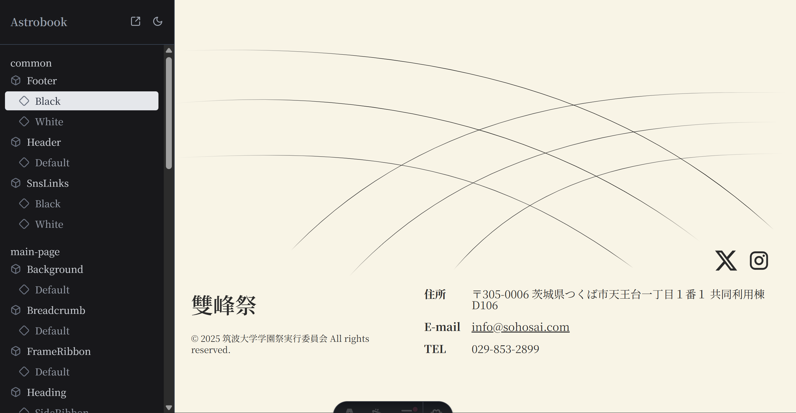
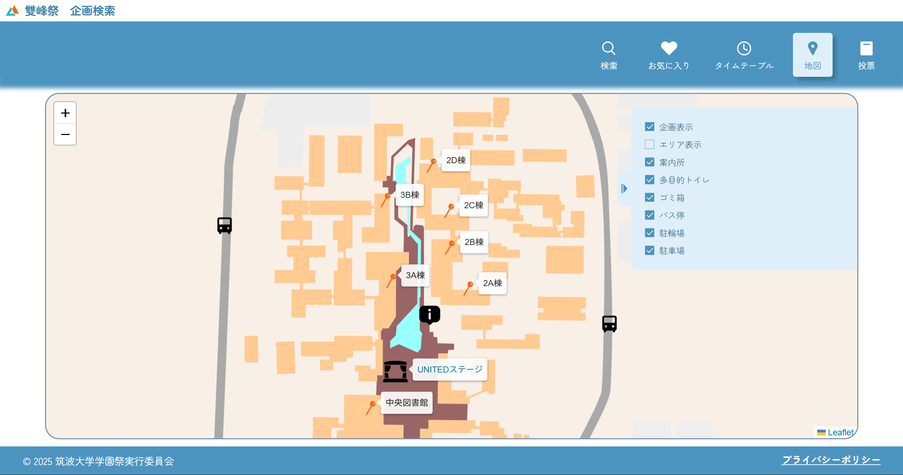

import Contents from "../../components/Contents.astro";

この記事は[jsys Advent Calendar 2025](https://adventar.org/calendars/11933) 19日目の記事です。気づけばもうクリスマスですね。かなり遅刻してしまいました。

<Contents headings={getHeadings()}></Contents>

こんにちは、にと（[@nito_008](https://x.com/nito_008)）と申します。

私は今年、筑波大学学園祭実行委員会の情報メディアシステム局（jsys）というところで、ネットワーク部門Web担当長をやっておりました。Web担当長という役職は、その名の通り*World Wide Web*に関わることをすべてやる...と見せかけて、事実上Webフロントエンドリーダー的な立ち位置でした。

jsysでは局内向けの物品管理システム、委員会と学園祭に出店する学生とのやり取りをサポートする雙峰祭オンラインシステム、そして来場者の方に向けた特設サイト、企画検索システムなど様々なシステムをすべて内製で開発・運用しています。

今回はその中でも、私が主に担当した特設サイトと企画検索システムのフロントエンドで使われている技術について解説していきたいと思います。

## 特設サイト

まず最初に解説するのは、雙峰祭直前期に公開される特設サイトです。来場者向けの情報や注意事項が掲載されています。私は全体設計・ライブラリ選定・基本的な部分の実装、そして一年生に実装タスクを振る役割を担いました。今年は、実装を担当してくれた一年生の皆さんの協力もあり、雙峰祭が行われる約一か月前に公開することができました。

https://sohosai.com/

トップページはこんな感じです。


背景には昨年度の雙峰祭の映像を映像部門長が編集してくれた動画が埋め込まれています。（映像はネットワーク部門長セレクションだったりします。）ffmpegでVP9コーデックによる驚異の圧縮が行われています。また、今年の雙峰祭のテーマである「むすんで、ひらけ」のロゴは、これまた映像部門長に作成してもらったアニメーションがGIFで埋め込まれています。映像部門長には頭が上がりません。（お願いして1、2日で作ってくれました。本当に感謝。）

### 技術スタック

- Astro
- Fontsource
- Embla Carousel

メインのフレームワークは[Astro](https://astro.build)を採用しました。Astroは軽量・高速なWebフレームワークで、ビルド時にJavaScriptを極限まで減らすのが特徴です。jsys内で静的サイトを作る際のデファクトスタンダードとなっていて、知見があったことも大きいです。

フォントは全て[Fontsource](https://fontsource.org/)から読み込むようにしています。npmパッケージとして手軽に追加でき、かつセルフホストなのでCDN経由より高速です。Fontsourceの変なバグを踏んでしっぽり明朝が適用されない事件などもあったりしましたが.....

また、カルーセル部分には[Embla Carousel](https://www.embla-carousel.com/)という軽量なカルーセルライブラリを使っています。ライブラリが持っているのはカルーセルのモーション部分だけであり、スタイルを自由に記述できる点が気に入っています。

### Linter/Formatter

- Prettier
- ESLint
- Stylelint

jsysではVSCodeユーザーが比較的多いため(もちろんNeoVim等のエディタを使っている方もいますが.....)、VSCodeの設定でLint/Formatが自動で走るようにしていました。

```json title=".vscode/settings.json"
{
  "editor.defaultFormatter": "esbenp.prettier-vscode",
  "editor.formatOnSave": true,
  "editor.codeActionsOnSave": {
    "source.fixAll": "explicit",
    "source.fixAll.eslint": "explicit",
    "source.fixAll.stylelint": "explicit"
  },
  "stylelint.validate": ["css", "astro"]
}
```

こうすることで、ファイル保存時に自動でLint/Formatが走ります。これのおかげでCIが落ちる回数がかなり減った気がします。

### 開発支援系

- Plop
- Astrobook

[Plop](https://github.com/plopjs/plop)はテンプレートからコンポーネントの雛型を自動生成することができるジェネレータ、[Astrobook](https://github.com/ocavue/astrobook)はStorybookのAstro代替です。

Astrobookではこんな感じにstories.tsを書いてあげることで、Storybookのようにコンポーネントのカタログが見れます。

```ts title="component.stories.ts"
import type { ComponentProps } from "astro/types";

import Component from "./Component.astro";

type Props = ComponentProps<typeof Component>;

export default {
  component: Component,
};

export const Default = {
  args: {} satisfies Props,
};
```

slotを文字列で渡す必要がある、GUIでPropsを変更できないなど、まだ未成熟ではありますが、単に静的サイトのコンポーネントを見るだけなら使えるだろうということで導入してみました。

今回は各コンポーネントを並行して実装していたので、レビューするときにそれぞれのコンポーネントを分けて確認できたのはかなり楽でした。ただ、Reactと違ってAstroではコンポーネントをフォルダごとに分けて管理するのが難しい（Component/index.astroとComponent.astroを同じように扱えない）ため、ファイルツリーで見たときに把握しづらくなってしまったのは課題でした。今回のような小規模なサイトなら問題ないですが、規模が大きくなると難しそうです。



Plopではテンプレートファイルを置いておくことで、対話形式でコンポーネントの雛型を作成できます。

```hbs title="plop-templates/component.astro.hbs"
--- 
interface Props { 
  text?: string; 
}

const { text } = Astro.props; 
---

<div>
  {text}
</div>

<style>
  /* スタイルはここに追加 */
</style>
```

```hbs title="plop-templates/component.stories.ts.hbs"
import type { ComponentProps } from "astro/types";

import Component from "./{{pascalCase name}}.astro";

type Props = ComponentProps<typeof Component>;

export default {
  component: Component ,
};

export const Default = {
  args: {} satisfies Props,
}
```

```
npm run plop

> astro-template@0.0.1 plop
> plop

? コンポーネントを作成したいフォルダを入力 (例：common) common
? コンポーネント名を入力 (例：Footer) Component
✔ ++ \src\components\common\Component.astro
✔ ++ \src\components\common\Component.stories.ts
```

## 企画検索システム

次に解説するのは、雙峰祭企画検索システムです。今年は昨年度より大幅に機能が追加され、お気に入り機能、投票機能、地図機能などが追加されました。これにより、フロントエンドもかなり複雑なものになりました。私は全体の設計・ライブラリ選定を担当し、実装の大部分は他の二年生が担当しました。

https://search.sohosai.com

### 技術スタック

- React
- Tanstack Router
- jotai
- Panda CSS
- React Reaflet
- React Hot Toast

メインのフレームワークは[React](https://react.dev/)、ルーティングライブラリは[Tanstack Router](https://tanstack.com/router/latest)を採用しました。Tanstack Routerは型安全なルーティングライブラリで、パスだけではなくクエリパラメータなども型安全に扱うことが可能です。また、ファイルベースのルーティングにも対応しているため、簡単にルーティングすることができます。

グローバルな状態管理には[jotai](https://jotai.org/)を使っています。結局contextとjotaiとqueryの使い分けベストプラクティスは分からずにいます。どうするのがいいんでしょうか。

また、CSSライブラリとして[Panda CSS](https://panda-css.com/)を採用しました。Panda CSSはスタイルをTSで型安全に書ける半面、インラインスタイルのようにも書けてしまうので可読性が難点でした。以下の記事を参考に、ファイルを分ける運用を試してみました。

https://qiita.com/tamako-info/items/fe643f79d1f33a1e5070

地図には[React Reaflet](https://react-leaflet.js.org/)を使いました。地図の背景となっている建物の画像は、デザイン担当が丹精込めて作成したものだったりします。地図上のピンも局員が一つ一つ丁寧にGoogle Mapで入力したものを変換しています。



投票時のトースト表示には[React Hot Toast](https://react-hot-toast.com/)を使っています。

### Query系

- Tanstack Query (旧React Query)
- openapi-typescript
- openapi-fetch
- openapi-react-query

バックエンドAPIから取得したデータの管理には[Tanstack Query (旧React Query)](https://tanstack.com/query/latest)を活用しました。これは非同期の状態管理ライブラリであり、fetch部分は[openapi-fetch](https://openapi-ts.dev/ja/openapi-fetch/)、OpenAPIスキーマからTypeScriptの型を自動生成する部分は[openapi-typescript](https://openapi-ts.dev/ja/introduction)を利用しています。

React Queryとの連携部分は[openapi-react-query](https://openapi-ts.dev/ja/openapi-react-query/)を使っているのですが、日本語の情報がほとんどなく、公式ドキュメントの情報も少ないので試行錯誤しながら使う部分もありました。このあたりの話は、別で記事にまとめているので気になる方はぜひご覧ください。

https://nito008.com/blog/openapi-react-query/

バックエンドのSwagggoが吐き出す`openapi.yaml`がOpenAPI 2.0で、openapi-typescriptが対応している3.0に闇の変換をかます必要があり困ったりしました。

openapi-react-queryは薄いWrapperとして実装されています。OrvalやKubbといったオールインワンの型・APIクライアント生成ツールに比べてバンドルサイズが小さく、自分の使いたい機能を後から追加していくスタイルで気に入っています。最近は[Mock Service Worker](https://mswjs.io/)と連携できる[openapi-msw](https://github.com/christoph-fricke/openapi-msw)を試したりしています。

### Linter/Formatter

- Prettier
- ESLint

特設サイトとほぼ同じですが、Panda CSSを導入したためStylelintのみ消えています。Panda CSSはStylelintでできるCSSプロパティの並び替えなどがうまくできないのが難点ですね。[eslint-plugin-perfectionist](https://perfectionist.dev/)などを使うとうまくできるんでしょうか。

### 開発支援系

- Plop
- Storybook

こちらでもPlop、そしてStorybookを導入しています。各コンポーネントは以下のようなフォルダ構造となっています。

```
components
└─Component
  ├─index.tsx         // Reactコンポーネントファイル
  ├─styles.ts         // Panda CSSスタイルファイル
  └─index.stories.tsx // Storybookファイル
```

Plopによるコンポーネントの雛型生成自動化はこちらの方が恩恵を感じました。ReactではComponent.tsxとComponent/index.tsxを同一に扱えるので、フォルダごとにコンポーネントを管理しやすいです。

## あとがき

今年度の特設サイト、そして企画検索システムには私の持てるフロントエンド技術をほぼ全て注ぎ込みました。プロジェクトリーダーとしてプロジェクトを引っ張っていくのは初めてであり、技術面・マネジメント面でトラブルに直面してばかりでしたが、同時に大きな成長を感じた一年でした。

Webフロントエンドは技術の進歩が速く、新しい技術が次から次へと出てくる印象です。私が本格的にフロントエンドに触れ始めた1年前から比べてもかなり進歩しているように感じます。新しい技術に触れるのは好きなので、今後も新たな技術に触れつつ、より早く使いやすいWebサイトを作れるようになりたいものですね。
