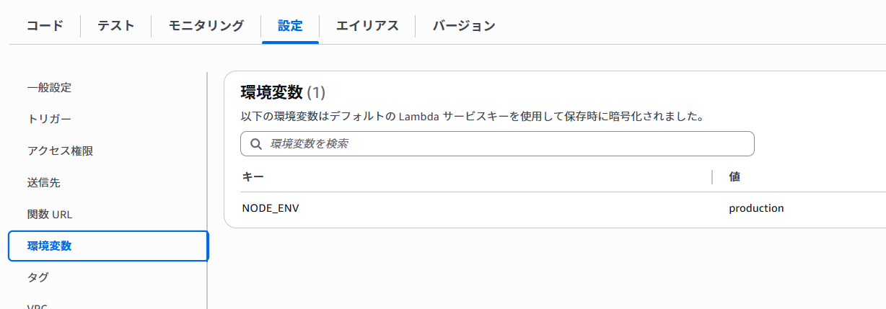
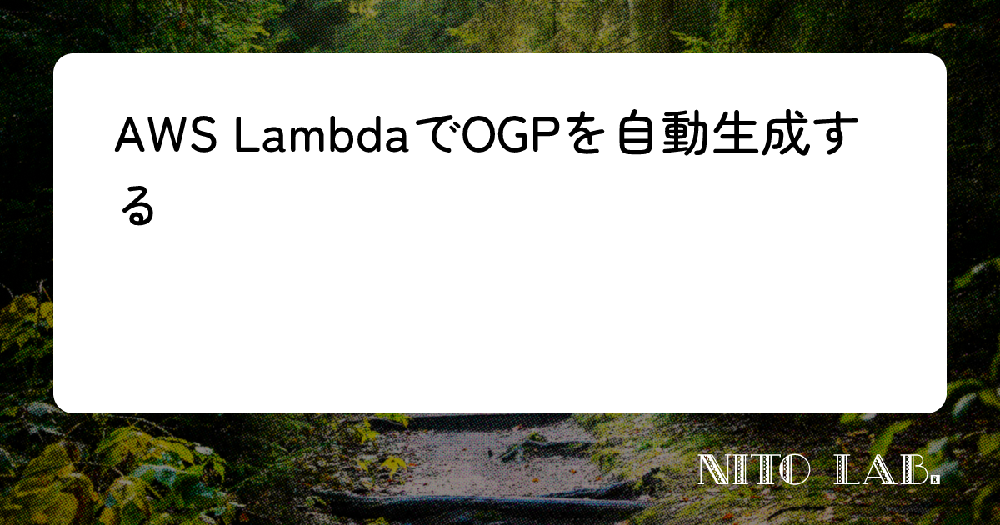
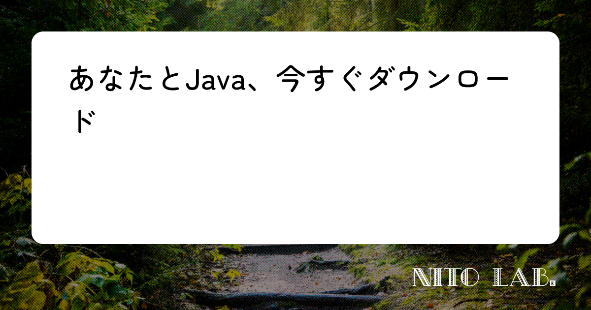

import Contents from "../../components/Contents.astro";

ブログのOGP生成をAWS Lambdaを使って自動化しました。

<Contents headings={getHeadings()}></Contents>

## Honoを使ってみる

AWS Lambdaではサービス固有のハンドラを書く必要がありますが、ベンダーロックインされたコードを書きたくなかったので[Hono](https://hono.dev/)を使ってエンドポイントを定義しました。
[AWS Lambda用ガイド](https://hono.dev/docs/getting-started/aws-lambda)に従うと簡単に雛型が作成できます。

```ts title="src/index.ts"
import { Hono } from "hono";
import { handle } from "hono/aws-lambda";
import { healthHandler } from "./handlers/health";
import { getOgImageHandler } from "./handlers/og";
import { logger } from "hono/logger";

export const app = new Hono();

app.use(logger());

app.get("/", (c) => c.text("Hello Hono!"));

app.get("/health", healthHandler);

app.get("/og", getOgImageHandler);

export const handler = handle(app);

export default app;
```

[AWS CLI](https://aws.amazon.com/jp/cli/)のインストールと設定もしておきます。

```sh
aws configure
```

## Satori+resvgでOGPを自動生成する

[Satori](https://github.com/vercel/satori)というJSXをSVGにレンダーするライブラリと、[resvg](https://github.com/linebender/resvg)というSVGをPNGに変換するライブラリ（Rust実装）を組み合わせる方法が主流のようなのでこれを使います。[@vercel/og](https://vercel.com/docs/og-image-generation)（Vercelが提供しているOGP生成ライブラリ）と同じ構成ですね。

```tsx title="src/handlers/og.tsx"
let isWasmInitialized = false;

...

if (!isWasmInitialized) {
  console.log("wasm initializing...");

  const wasmPath = path.resolve(
    process.cwd(),
    process.env.NODE_ENV == "production"
      ? "index_bg.wasm"
      : "node_modules/@resvg/resvg-wasm/index_bg.wasm",
  );
  const wasmBuffer = await fs.readFile(wasmPath);

  await initWasm(wasmBuffer);
  isWasmInitialized = true;
  console.log("wasm initialized");
}

...

const svg = await satori(<OgImage title={title} />, {
  width: 1200,
  height: 630,
  fonts: fontData,
});

const resvg = new Resvg(svg, {
  fitTo: {
    mode: "width",
    value: 1200,
  },
});
const image = resvg.render();
return c.body(Buffer.from(image.asPng()), 200, {
  "Content-Type": "image/png",
});

...
```

Satoriの方はすんなり動きましたが、resvgはRust実装のためAWS Lambdaで動かそうと思うと少し工夫がいります。npm packageには[バイナリ版](https://www.npmjs.com/package/@resvg/resvg-js)と[Wasm版](https://www.npmjs.com/package/@resvg/resvg-wasm)が存在していますが、手元のWindowsとAWS Lambda (Linux) 両方で動くWasm版を選択しました。

tsファイルのビルドには[esbuild](https://esbuild.github.io/)を使用しました。zipファイルにまとめる前に[esbuild-copy-plugin](https://github.com/sprout2000/esbuild-copy-plugin)を使ってフォントや画像などのアセットやWasmバイナリをdistフォルダにコピーするようにしています。

また、開発環境と本番環境でパスが違うファイル（フォントや画像、wasmファイル）はこんな感じに`NODE_ENV`環境変数で切り替えています。（`NODE_ENV`はAWS Lambdaではデフォルトで設定されているわけではないので、手動で設定する必要があります。）

```tsx title="src/handlers/og.tsx"
const wasmPath = path.resolve(
  process.cwd(),
  process.env.NODE_ENV == "production"
    ? "index_bg.wasm"
    : "node_modules/@resvg/resvg-wasm/index_bg.wasm",
);
```



## 開発用サーバーをBunで立てる

JS/TS用統合ツールキットである[Bun](https://bun.com/docs)を使うとViteなどのパッケージを別途導入せずとも開発サーバーを立てられます。

```json title="package.json" ins={3}
{
  "scripts": {
    "dev": "bun run --hot src/index.ts"
  }
}
```

npmなど他のパッケージマネージャより高速に動作し、開発サーバーやパッチといった開発に必要な機能が一つにまとまっているのがいいですね。

## 改行位置を調整したい

長いタイトルを入れるとこんな感じに変な位置で改行されてしまいます。



これを直すために、[BudouX](https://github.com/google/budoux)というGoogleが出している自然な改行位置で文章を分割してくれるライブラリを使ってみます。

```sh
bun install budoux
```

```tsx title="src/handlers/OgImage.tsx"
import { loadDefaultJapaneseParser } from "budoux";

...

const parser = loadDefaultJapaneseParser();

...

<div
  style={{
    fontSize: 60,
    fontFamily: "Zen Maru Gothic",
    background: "white",
    borderRadius: 24,
    color: "black",
    padding: "48px 72px",
    display: "flex",
    flexWrap: "wrap",
    flex: "1",
  }}
>
  {parser.parse(title ?? "").map((chunk) => (
    <span>{chunk}</span>
  ))}
</div>

...
```

budouxの中身は非常に軽量な機械学習モデル（15KBほど）なのでAWS Lambdaにも余裕で組み込めます。

結果はこんな感じ



## AWS Lambdaにデプロイする

作ったものをAWS Lambdaにデプロイします。

```sh
bun run deploy
```

これだけでビルドされたjsファイルがアセットとともにzipファイルに圧縮されてデプロイされます。

Lambdaへのアクセスですが、今回は自分だけがアクセスできれば良いのでAPI Gatewayは使わずLambdaの関数URL機能を使います。

認証付きの関数URLを作成してcurlしてみます。

```sh
export AWS_ACCESS_KEY_ID=AKIA...
export AWS_SECRET_ACCESS_KEY=secret...
curl --request GET \
--aws-sigv4 "aws:amz:<AWSのリージョン>:lambda" \
--user "${AWS_ACCESS_KEY_ID}:${AWS_SECRET_ACCESS_KEY}" \
"https://<関数URL>/og?title=hogehoge" \
> ogp.png
```

AWS Lambdaの設定はアーキテクチャ: arm64, メモリ: 1024MBにしました。1~3秒ぐらいで画像が生成されるので十分でしょう。

## あとがき

今回OGPを自動生成するにあたって参考にした記事を貼っておきます。

https://mizuame.works/slides/AWSLambda%E3%81%A7SVG%20to%20PNG%20%E7%94%9F%E6%88%90API%E3%82%92%E7%94%9F%E3%82%84%E3%81%97%E3%81%9F/

https://qiita.com/ssc-ksaitou/items/4a1a1e437d4139b32d19

最近ブログを書くのに使っている[Frontmatter CMS](https://frontmatter.codes/)と連携するとさらに快適にブログが書けそうな気がしています。近々それについての記事も出す予定です。
