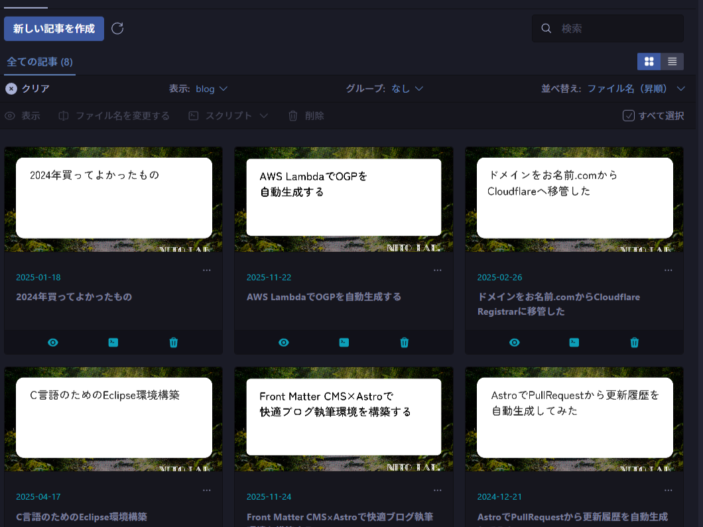
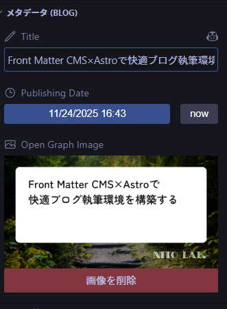
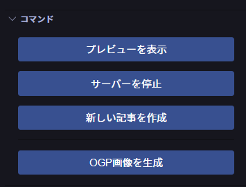

import Contents from "../../components/Contents.astro";

最近個人ブログに導入した[Front Matter CMS](https://frontmatter.codes/)が便利だったので紹介します。

<Contents headings={getHeadings()}></Contents>

## Front Matter CMSとは？

Front Matter CMSは静的サイトジェネレータ向けHeadless CMSです。ただのVS Code拡張なので既存のサイトでも簡単に導入できます。シンプルかつカスタマイズが可能なので、マークダウンで記事を管理している個人ブログと非常に相性がいいです。

## AstroにFront Matter CMSを導入してみる

[Astro公式Front Matter CMS Integration](https://docs.astro.build/ja/guides/cms/frontmatter-cms/)に導入方法が書いてあるのでこれに従って導入します。

とはいえ`frontmatter.json`を書くだけなので、他のフレームワークにも簡単に導入できそうです。

## ダッシュボード

Front Matter CMSのダッシュボードはこんな感じです。



各記事のOGP画像、公開日、タイトルが一覧で見れます。クリックすると各記事のMarkdownファイルに飛ぶこともできます。

## Front Matterの編集

サイドパネルでMarkdownのFront Matterを編集できます。nowを押すと現在時刻（UTC）が自動で入ったり、OGP画像をプレビューできたりします。



## コマンド

開発サーバーの起動やVSCode上でのプレビュー表示などがワンクリックでできます。



不要なコマンドは非表示にできます。

```json title="frontmatter.json"
{
  "frontMatter.panel.actions.disabled": ["optimizeSlug", "openDashboard"]
}
```

## カスタムスクリプト

個人的にかなり気に入っている機能です。カスタムスクリプトをコマンドに追加することができます。このブログでは[AWS LambdaでOGP画像を自動生成する](/blog/aws-lambda-ogp-autogen)で作成したAWS Lambda関数をコマンドで呼び出せるようにしています。

```json title="frontmatter.json"
{
  "frontMatter.custom.scripts": [
    {
      "id": "generate-og-image",
      "title": "OGP画像を生成",
      "script": "./scripts/generate-og-image.ts",
      "command": "bun"
    }
  ]
}
```

コンテンツ作成時にカスタムスクリプトを呼び出すこともできます。

```json title="frontmatter.json"
{
  "frontMatter.taxonomy.contentTypes": [
    {
      "name": "blog",
      "postScript": "generate-og-image"
    }
  ]
}
```

[@frontmatter/extensibility](https://frontmatter.codes/docs/custom-actions#extensibility-library)を使うと、TS/JSでカスタムスクリプトを簡単に書けます。

```ts title="generate-og-image.ts"
import { ContentScript } from "@frontmatter/extensibility";

const args = ContentScript.getArguments();

// args.frontMatterでFront Matterを取得できる

...

ContentScript.done("OGP画像を生成しました"); // ユーザーに通知する
```

まだ開発途中なのか、`ContentScript.updateFrontMatter()`はモックだったので、Front Matterの更新には[gray-matter](https://github.com/jonschlinkert/gray-matter)を使いました。

## 今回参考にした記事

https://voltaney.com/posts/astro-frontmatter-cms/

## あとがき

Front Matter CMSによってブログが前より手軽に書けるようになりました。他のHeadless CMSに比べて導入ハードルが低く、機能面でも個人ブログ程度の規模なら必要十分感があります。個人ブログをマークダウンで書いている方はぜひ一度試してはどうでしょうか？
