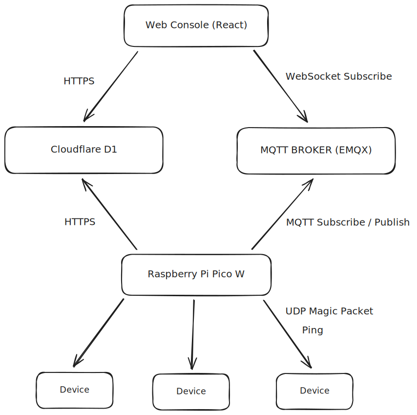
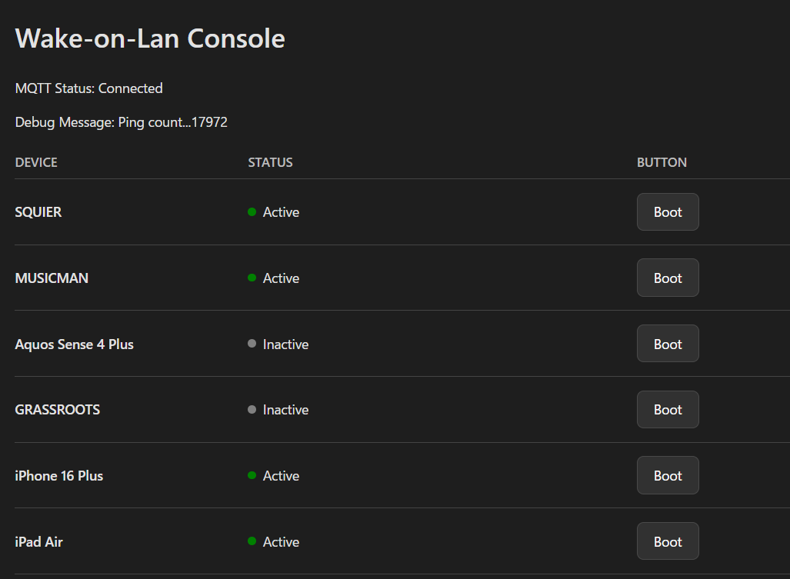

import Contents from "../../components/Contents.astro";

この記事は[coins Advent Calender 2025](https://adventar.org/calendars/11747)、6日目の記事です。

初めましての方は初めまして、嘘coins、もといesys24のにとです。esys（工学システム学類）ですが普段はかなりcoinsっぽいことをしています。

<Contents headings={getHeadings()}></Contents>

## リモートデスクトップが便利すぎる

私は現在、自宅ではWindowsデスクトップPC、大学など外ではWindowsノートPCを主に使っています。ノートPCの方はメモリが16GBなので、エディタとDockerとChromeを起動しただけで目に見えて重くなります。さすがに重すぎたのでWindowsを消し飛ばしてUbuntuを入れてみたり、
Chrome Remote DesktopやMoonlightなどのRDPを試してみたりとかなり試行錯誤したのですが、最終的にWindows標準のリモートデスクトップ機能(RDP)に落ち着きました。

Windows標準RDPはクリップボードの内容やファイルを簡単に転送できたりWindowsキーが使えたりと地味に便利なところが多く、愛用しています。ただし、接続先のPCがWindows Proでないと使えないので注意が必要ですが...（coinsの皆さんはWindows Proのライセンスが全員付与されていると風のうわさで聞いたので、活用すると良さそうです。）

## 起動が、面倒

これでどこでも快適な環境で作業ができると思っていたのですが、一つ問題が発覚しました。RDPで接続するには接続先のPCが起動している必要性があります。常時起動というのも考えましたが、私のPC筐体はなぜか前面のロゴやUSBポートにLEDが仕込まれているため、
寝るときもビカビカに光ってしまい、たまったものではありません。

寝る前に消し、朝出かける前にPCを起動しておくという手もありますが、単純に面倒ですし、起動を忘れて結局ノートPCで作業するなどというマヌケなことも起こります。

これはいけない。

そう思った私は自宅PC遠隔起動システムを作ることにしました。

## 全体構成

今回作ったシステムの全体像はこんな感じです。



### Raspberry Pi Pico Wとは

[Raspberry Pi Pico W](https://www.raspberrypi.com/documentation/microcontrollers/pico-series.html)(通称ラズピコ)はラズペリーパイ財団が出しているマイコンボードです。RP2040チップにInfenion CY43439という無線モジュールが搭載されており、秋月電子で一つ1200円という値段ながら簡単なWebサーバーくらいなら立てられるスペックを持っています。

今回はラズピコ経由でPCを遠隔起動します。

### MQTTとは

[MQTT](https://mqtt.org/)とは、リソースの限られたIoT機器向けのメッセージングプロトコルです。非常に軽量なのが特長で、MQTT Brokerに対してIoT機器がPublish/Subscribeすることでメッセージのやり取りをします。

MQTT Brokerとして [EMQX Serverless](https://www.emqx.com/ja/cloud/serverless-mqtt)を採用しました。毎月100万接続分, トラフィック量1GBまで無料なので個人利用ならまず超えることはないでしょう。

PlatformIOでMQTTを扱うには[PubSubClient](https://github.com/knolleary/pubsubclient)というライブラリを使います。MQTT 3.1.1までしか対応していません（最新は5、なぜか4はない）が、基本的なところは同じで後方互換性もあるのでOK。

## PlatformIOでRaspberry Pi Pico W用ファームウェアを書く

最近組み込み用コードを書くときに[PlatformIO](https://platformio.org/)が便利なので使っています。エディタの拡張機能やCLIとして手軽に導入でき、ライブラリも豊富なので重宝しています。

公式が出しているPlatformIOのRaspberry Pi Pico用platformはあまり更新されていないため、有志が出している[フォーク](https://github.com/maxgerhardt/platform-raspberrypi.git)を活用しました。

```ini title=platformio.ini
[env:rpipicow]
platform = https://github.com/maxgerhardt/platform-raspberrypi.git
framework = arduino
lib_deps =
	knolleary/PubSubClient@^2.8
	bblanchon/ArduinoJson@^7.4.2
monitor_port = COM4
monitor_speed = 115200
board = rpipicow
```

### Arduino OTA(Over The Air) を試す

[Arduino OTA](https://github.com/JAndrassy/ArduinoOTA)というライブラリを使うと、Wi-fi経由でファームウェアを書き込むことができます。PlatformIOではArduinoのライブラリもそのまま使えるので試してみます。

```ini title=platformio.ini
[env:rpipicow]
board_build.filesystem_size = 1m
; OTA (Over The Air) Update
upload_protocol = espota
upload_port = 192.168.0.25
```

`board_build.filesystem_size`を指定してファイルシステム領域を作成しないとOTAで受け取ったプログラムを保存できずに次のようなエラーが出るので忘れず設定します。

```cmd
[ERROR]: Bad Answer: ERR: No Filesystem
```

```cpp title=main.cpp
#include <ArduinoOTA.h>

void setup() {
  setUpOTA();
}

void loop()
{
  ArduinoOTA.handle();
}
```

これだけでWi-fi経由でのファームウェア更新が可能です。初回のみOTAのコードを書きこむ必要があるのでUSBケーブルは必須ですが、それが終わればWi-fi経由での更新が可能になります。（とはいえ、別の処理でハングしたりすると当然OTAも死ぬのでその点は注意。）

```cmd
21:59:46 [DEBUG]: Options: {'esp_ip': '192.168.0.25', 'host_ip': '0.0.0.0', 'esp_port': 2040, 'host_port': 53496, 'auth': '', 'image': '.pio\\build\\rpipicow\\firmware.bin', 'spiffs': False, 'debug': True, 'progress': True}
21:59:46 [INFO]: Starting on 0.0.0.0:53496
21:59:46 [INFO]: Upload size: 583456
21:59:46 [INFO]: Sending invitation to: 192.168.0.25
21:59:46 [INFO]: Waiting for device...


Uploading: [                                                            ] 0%
...
Uploading: [============================================================] 99%
Uploading: [============================================================] 100% Done...


21:59:56 [INFO]: Waiting for result...
21:59:58 [INFO]: Result: OK
Complete
===================
```

### FreeRTOSで非同期処理を実装する

RP2040はARM Cortex-M0+デュアルコアCPUを搭載しており、通常コードはコア0のみで実行され、コア1は低電力アイドル状態となっています。MQTTのsubscriptionとpingを非同期的に処理するためにも、デュアルコアを活用しない手はないでしょう。

PlatformIO(Arduino)+Raspberry Pi Picoで非同期処理をする方法は主に二つ、`rp2040`ライブラリのマルチプロセッシング機能を直接使う方法と[FreeRTOS](https://freertos.org/)を使う方法があります。今回は後者を採用しました。

FreeRTOSはマイクロコントローラ及び小型マイクロプロセッサ用のRTOSです。RTOS(Real-Time Operating System)とは主に組み込みシステムで用いられるリアルタイム性を重視したOSであり、各タスクに厳格な処理優先度が定められているのが特長です。

FreeRTOSではqueueを用いて別のタスクに対してデータを渡すことができるので、これを使って非同期処理を実装していきます。

まず、FreeRTOSを使うためにフラグを有効にします。

```ini title=platformio.ini
[env:rpipicow]
build_flags = -DPIO_FRAMEWORK_ARDUINO_ENABLE_FREERTOS
```

そして、queueを使ったタスク間データ共有を実装します。（以下queue処理のサンプルコード）

```cpp title=main.cpp
#include <FreeRTOS.h>
#include <queue.h>

struct PingMessage
{
  char deviceName[64];
  int resultMs;
};

QueueHandle_t pingQueue;

void setup() {
  Serial.begin(115200);
  pingQueue = xQueueCreate(10, sizeof(PingMessage));
}

void loop() {
  PingMessage msg;
  if (xQueueReceive(pingQueue, &msg, 0) == pdTRUE)
  {
    Serial.print("Device name: %s, Result ms: %d", msg.deviceName, msg.resultMs);
  }
}

void setup1() {}

void loop1() {
  PingMessage msg;
  sprintf(msg.deviceName, "device_name");
  msg.resultMs = 0;
  xQueueSend(pingQueue, &msg, portMAX_DELAY);
}
```

[Arduino Pico](https://arduino-pico.readthedocs.io/en/latest/freertos.html)によると、`setup`、`loop`がコア0、`setup1`、`loop1`がコア1に対応しているので、それぞれのコアで実行したい処理を書きます。今回はコア0でArduino OTAとMQTTの処理、コア1でpingの処理を実行するようにしました。

`QueueHandle_t`型の変数を定義しておいて、`setup`でqueueの作成、`loop1`でping結果のqueueへの送信、`loop`でping結果をqueueから受信しています。

### Wake-on-Lan(WoL)機能の実装

いよいよ本命の遠隔起動機能を実装します。遠隔起動にはWake-on-Lan(WoL)という仕組みを使います。WoLはLAN内のPCの電源を別のPCから遠隔でONにする機能のことです。LAN経由で起動する都合上、ハードウェアWoL（完全に電源が落ちている状態からの起動。休止状態やスリープから復帰するものはソフトウェアWoLと言う。）完全な電源OFF状態から起動する都合上、有線LANでつながっている必要があります。

WoLを使うには、BIOS/UEFI側でWoL機能を有効にする必要があります。次の記事が詳しいので参考になりました。

https://zenn.dev/headwaters/articles/317fa82c78e077

Wake-on-Lanの仕組み自体は簡単で、マジックパケットと呼ばれる48ビットのブロードキャストアドレス（FF:FF:FF:FF:FF:FF）に続いて起動したいPCのMACアドレスを16回繰り返した計102バイトのデータで構成されるUDPパケットをブロードキャストすることで、それを受け取ったPCが起動するという恰好です。

実際のコードはこちら

https://github.com/nito-008/wake-on-lan-picow/tree/main

## Web Console、DBの実装

あとはWeb ConsoleとIPアドレスやデバイス名を管理するDBを作れば完成です。

Web ConsoleはReactで実装し、Cloudflare Pagesでホストしています。

見た目はこんな感じ。



余談ですが、Appleのモバイル製品は画面OFF時はpingが通らず、画面をタップしてONになるとpingが通るようになってちょっと面白かったです。恐らく低電力モードに移行するようになっているのでしょうが、他社製品もそうなのか気になります。

DBはCloudflare D1を使っています。相も変わらず全身がCloudflareです。貧乏学生の味方。

DBといっても単純なもので、デバイス名とMACアドレス、IPアドレスのみを持っています。

これまたCloudflare WorkersでAPIエンドポイントを立て、それを叩くようにしています。

クライアントのコード

https://github.com/nito-008/wake-on-lan-client

APIエンドポイントのコード

https://github.com/nito-008/wake-on-lan-db

## あとがき

少し長くなってしまいましたが、これにて無事自宅PC遠隔起動システムが完成しました。ラズピコは安い割に思いのほか色んなことができるので面白いです。皆さんもぜひ買ってみてはどうでしょうか。
